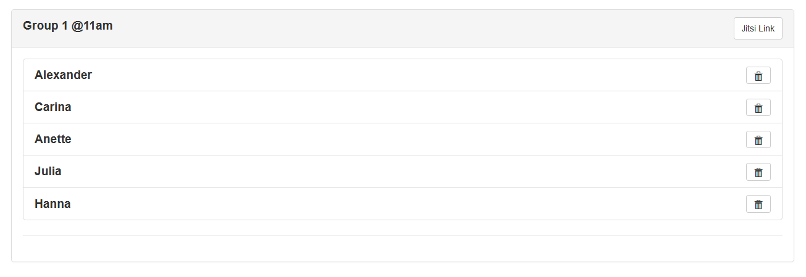
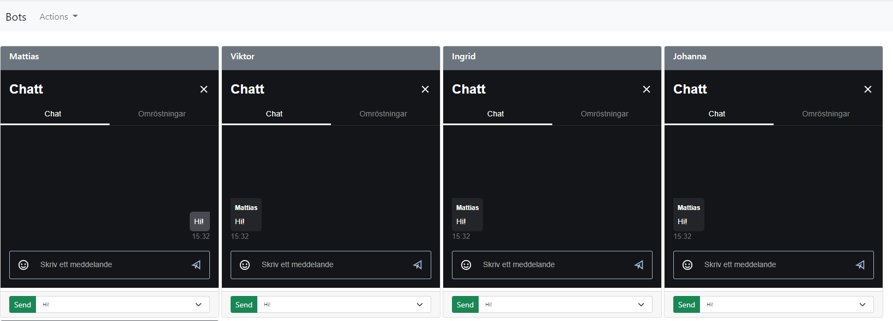
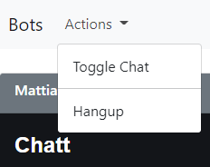
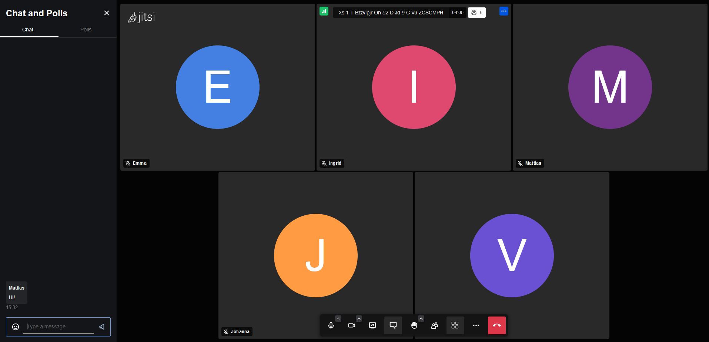

#User guide 

## Setting up calls

### Login 
Before you can use the application you need to have an user-account. If you didn't set up the system on your own, please ask your system administrator to set up an account. 
Instructions for adding users can be found in the [installation documentation](installation.md#Installation-scripts).

### Calls
Once logged in to the application the main application window lists all scheduled calls.

Adding new calls is done from the action menu.

When clicked a form will be presented in a modal window where you fill in a title for the call and select the jitsi service that will host the actual video call.
Instructions for adding jitsi services can be found in the [Environment variables](installation.md#Environment-variables) part of the installation documentation.

!!! Note
    The naming of the calls in this example is just a suggestion. The naming of the calls can be totally arbitrary. So you can use any convention that will work for your needs. 

By clicking either the "view" button or the calls title will open the detail view for the call. 

### Call detail view

From the detail views action menu bots can be added. 

When clicked a form for adding bots will be presented in a modal window. 

The add bot form takes the following arguments:

* Number of bots to genarate
* Year of birth start/end (Used to filter bots that fall in a range of years)
* Gender
* Generate random participant ids (If checked the application will add some random alphanumeric numbers to the botnames)

!!! Note
    If you're not satisfied with the randomization of the bots you can delete them by clicking the trash icon. 

For copying the link to the call for distribution to participants click the **Jitsi Link** button. The link will then be saved in your clipboard and can be pasted 
into an email. 

## Starting a call 
Start the call by clicking **Open meeting** in the action menu

### Bot puppeteer view
The bot puppeteer view will open a call for each bot in separate frames. Within each frame there's a drop down list with predefined chat messages that can be sent 
But it is of course possible to send any text message using the field above the dropdown. Adding predefined messages is done in settings which is found under the 
main applications action menu.

!!! Note 
    See documentation for [Settings](#Settings)

From the action menu there are two quick functions one for toggling the chat windows of jitsi and one for disconnecting 
all the bots with one click which can be used to simulate a breakout room (A function that is not available in jitsi )

### Participant view 

The conference call as seen by the participant.

## Settings
Application settings is accessed from the main applications action menu.

On the settings page you can add the predefined messages that can be used by the bot puppeteer. You can also manually add bot names that are going to be used for 
the random selection when you add them to a call. 

